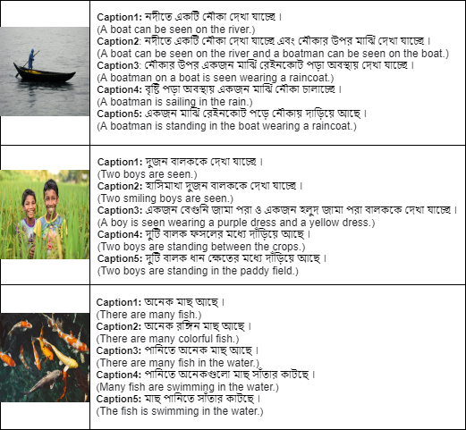
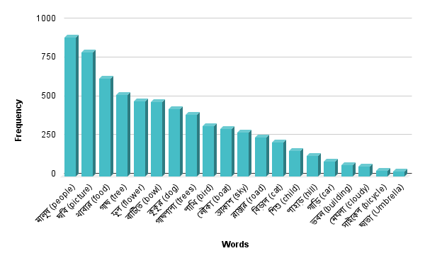

# Bornon_Dataset

Due to the lack of a Bengali image captioning dataset, we created a new dataset named Bornon. The Bornon dataset consists of 4100 images and each image has five captions describe them. Thus, there is a total of 20500 captions for 4100 images. All these images were selected randomly. Images were kept in a folder and the associated captions were kept in a text file. Some images of the Bornon dataset along with their associated captions are shown in the following figure.

The images of this dataset were taken from a personal photography club. All images were in jpg format. These images portray various objects like Animals, Birds, People, Food, Weather, Trees, Flower, Buildings, Cars, Boat. Frequent Bengali words in this dataset are illustrated in the following figure.

Around 17 people who are native Bengali speakers were responsible for annotating and evaluating the captions. The vocabulary size of the Bornon dataset was 6228 unique Bengali words for only 4100 images. If vocabulary size is small, repetition of words is observed in predicted captions. However, this 4100 data are not enough to train a transformer-based mode. Therefore, in the future, we plan to increase the number of images in our dataset.

## If you wish to use this dataset please cite this <a href="Houses_with_Lighting_CameraMovement_Texture/visualization.pdf">paper</a>.
* The images o this dataset can be found <a href="https://drive.google.com/drive/folders/1FWR4RhzxRooiCMmpdfFDM592hHWpYy4c?usp=sharing">here</a>.
* The txt files can be found <a href="textFile/">here</a>.
